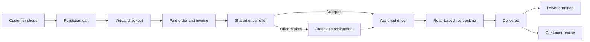

<div align="center">
  

  # GreenCart Express

  **A complete Flask e-commerce and last-mile delivery demonstration.**

  Shop products, complete a virtual checkout, dispatch deliveries, follow drivers on live maps, manage operations, and explore role-specific dashboards from one application.

  [](https://www.python.org/)
  [](https://flask.palletsprojects.com/)
  [](https://www.sqlalchemy.org/)
  [](#testing)
  [](#important-demo-notice)

  [Features](#features) · [How it works](#how-it-works) · [Quick start](#quick-start) · [Demo accounts](#demo-accounts) · [Deployment](#deployment) · [Full documentation](Project_Guide.md)
</div>

---

## About the project

GreenCart Express is a portfolio-ready marketplace that demonstrates the complete journey of an online order—from browsing and payment through driver dispatch and final delivery.

It includes dedicated experiences for customers, drivers, and administrators rather than treating delivery as a simple order-status field. The project also includes a persistent cart, virtual wallet, coupons and rewards, invoices, support tickets, notifications, product reviews, automatic dispatch, road-based route simulation, analytics, audit history, database migrations, and automated tests.

> [!IMPORTANT]
> This is a demonstration application. Payments, wallet funds, refunds, revenue, and driver earnings are virtual. No real payment provider is contacted and no real money is transferred.

## Product preview

The repository includes 30 original, optimized, locally hosted catalog images. A new database connects to them automatically—no placeholder image service is required.

| Fresh groceries | Electronics | Everyday essentials |
| :---: | :---: | :---: |
|  |  |  |

## Features

### Customer experience

- Responsive storefront with search, category filters, related products, ratings, and stock visibility.
- Persistent database-backed cart with quantity controls that survives sign-out.
- Multi-item checkout with delivery information, map destination, coupons, reward points, and delivery charges.
- Demo card and mobile-wallet payments using a persistent virtual balance.
- Professional order codes, invoices, payment breakdowns, delivery timeline, cancellation, and virtual refunds.
- Embedded live tracking with road routes, estimated arrival, driver movement, and last-location updates.
- Product reviews for delivered purchases, promotional offers, notifications, support tickets, and profile settings.

### Driver experience

- Driver registration and administrator approval workflow.
- Shared delivery offer pool with atomic acceptance—the first accepting driver receives the order.
- Multiple simultaneous deliveries, automatic fallback assignment, and an optimized route queue.
- Separate availability and working-schedule controls.
- Delivery detail pages with customer, package, route, ETA, and virtual fee information.
- Browser location sharing and embedded road routing from the current position to each destination.
- Delivery history, earnings ledger, performance metrics, notifications, support, and issue reporting.
- Automatic return to **Available** after all active deliveries are complete.

### Administrator experience

- Operational overview with revenue, orders, driver locations, and low-stock alerts.
- Complete order search, filtering, inspection, status management, live tracking, cancellation, and refunds.
- Manual assignment and reassignment alongside driver acceptance and automatic dispatch.
- Customer accounts, balances, rewards, order history, and suspension controls.
- Driver approval, availability, schedules, workloads, locations, performance, earnings, and issue reports.
- Product, stock, category, image, activation, coupon, and promotion management.
- Sales analytics, announcements, support-ticket handling, audit logs, and application settings.

### Platform foundations

- Secure password hashing, CSRF-protected forms, session authentication, and role-based authorization.
- Responsive layouts, accessible form behavior, mobile navigation, toast notifications, and custom error pages.
- SQLite for local development and PostgreSQL support for deployment.
- Alembic migrations, idempotent initialization, a deterministic starter catalog, and automated workflow tests.
- Upload validation and automatic WebP normalization for profile and product images.

## How it works



1. A customer adds products and quantities to a cart stored in the database.
2. Checkout validates delivery details, location, optional discounts, and a demo payment method.
3. Virtual funds are debited, stock is reduced, and the customer receives an invoice.
4. Eligible on-shift drivers can accept the offer; acceptance is atomic across drivers.
5. If nobody accepts in time, the application selects an eligible driver automatically.
6. The driver follows a simulated road route while all roles receive status and location updates.
7. Completion records virtual earnings and lets the customer review purchased products.

## Technology

| Layer | Technologies |
| --- | --- |
| Backend | Python, Flask, Flask-Login, Flask-WTF, SQLAlchemy, Flask-Migrate/Alembic |
| Frontend | Jinja, Tailwind CSS CDN, custom CSS, vanilla JavaScript |
| Maps | Leaflet, OpenStreetMap, OSRM routing |
| Media | Pillow image normalization, local WebP catalog assets |
| Data | SQLite locally, PostgreSQL in deployment |
| Quality | Pytest, isolated in-memory test database |
| Server | Gunicorn |

## Quick start

Python 3.11 or newer is recommended.

### Windows PowerShell

```powershell
git clone <your-repository-url>
cd <repository-folder>

py -m venv .venv
.\.venv\Scripts\Activate.ps1
python -m pip install --upgrade pip
python -m pip install -r requirements-dev.txt

Copy-Item .env.example .env
python initialize.py --demo
python run.py
```

### macOS or Linux

```bash
git clone <your-repository-url>
cd <repository-folder>

python3 -m venv .venv
source .venv/bin/activate
python -m pip install --upgrade pip
python -m pip install -r requirements-dev.txt

cp .env.example .env
python initialize.py --demo
python run.py
```

Open [http://127.0.0.1:5000](http://127.0.0.1:5000).

The initializer applies every migration, synchronizes the 30-product catalog, and creates demo accounts. It is safe to run again and does not duplicate existing data.

## Demo accounts

Created only when running `python initialize.py --demo`:

| Role | Username | Password |
| --- | --- | --- |
| Administrator | `admin` | `admin123` |
| Customer | `customer` | `customer123` |
| Driver | `driver` | `driver123` |

> [!WARNING]
> Never use these credentials in a public or production deployment.

## Project structure

```text
GreenCart-Express/
├── app/
│   ├── __init__.py          # Application factory and extensions
│   ├── models.py            # Data models and display helpers
│   ├── routes.py            # Public and role-specific routes/APIs
│   ├── static/
│   │   ├── catalog/         # 30 permanent optimized product images
│   │   ├── uploads/         # Ignored runtime uploads
│   │   ├── app.css
│   │   └── app.js
│   └── templates/           # Jinja pages for all roles
├── instance/                # Ignored runtime SQLite data
├── migrations/              # Alembic migration history
├── tests/                   # Automated workflow/security tests
├── initialize.py            # Idempotent database setup
├── seed_catalog.py          # Starter product catalog
├── config.py
├── run.py
└── requirements*.txt
```

Runtime databases, secrets, virtual environments, caches, backups, and user uploads are excluded through `.gitignore`. Every new clone therefore starts with a clean database.

## Configuration

Copy `.env.example` to `.env`, then adjust values as needed:

| Variable | Purpose |
| --- | --- |
| `APP_ENV` | Selects development or production behavior. |
| `SECRET_KEY` | Signs sessions and CSRF tokens; mandatory in production. |
| `SQLALCHEMY_DATABASE_URI` | Uses SQLite by default or a PostgreSQL URL when deployed. |
| `ADMIN_USERNAME` | Initial non-demo administrator username. |
| `ADMIN_PASSWORD` | Initial non-demo administrator password. |
| `ADMIN_NAME` | Optional administrator display name. |
| `ADMIN_EMAIL` | Optional administrator email. |

For the complete configuration reference, migration workflow, and troubleshooting guide, see [Project_Guide.md](Project_Guide.md).

## Testing

```bash
python -m pytest -q
```

The suite uses an isolated in-memory database and temporary upload directories. It covers authentication and authorization, carts, virtual checkout, coupons and rewards, invoices, refunds, image processing, driver acceptance and automatic assignment, tracking, earnings, support, reviews, notifications, and administrative access controls.

## Deployment

For a production-style deployment:

1. Provision a persistent PostgreSQL database.
2. Set `APP_ENV=production` and generate a strong `SECRET_KEY`.
3. Set `SQLALCHEMY_DATABASE_URI` and secure initial administrator credentials.
4. Install dependencies with `pip install -r requirements.txt`.
5. Run `python initialize.py` during the first release, or apply later migrations with `flask --app run.py db upgrade`.
6. Start the application with `gunicorn run:app`.
7. Use durable object storage if uploaded media must survive deployments.

The included `Procfile` provides the Gunicorn start command for compatible hosting platforms.

## Important demo notice

GreenCart Express intentionally simulates its financial and delivery systems:

- Card and mobile-wallet details are validated for realistic formatting but are not sent to a provider.
- Payment identifiers entered by users are not stored.
- Wallet balances, order payments, refunds, revenue, and driver earnings are virtual ledger entries.
- Driver movement is a timed simulation along calculated route geometry.
- The browser currently drives the demonstration dispatch heartbeat; a real service should use background workers.

Before adapting the project for real commerce, add a PCI-compliant payment provider, webhook verification, background jobs, durable object storage, transactional messaging, rate limiting, monitoring, backups, and a full accessibility/security review.

## Documentation

The comprehensive [project manual](Project_Guide.md) includes:

- Every customer, driver, administrator, and platform capability.
- Environment variables and fresh-database behavior.
- Database migrations and catalog initialization.
- Virtual payment, refund, dispatch, tracking, and upload behavior.
- Testing, production deployment, security notes, and troubleshooting.

---

<div align="center">
  <strong>GreenCart Express</strong><br>
  Fresh shopping, transparent dispatch, and delivery operations in one demonstration platform.
</div>
